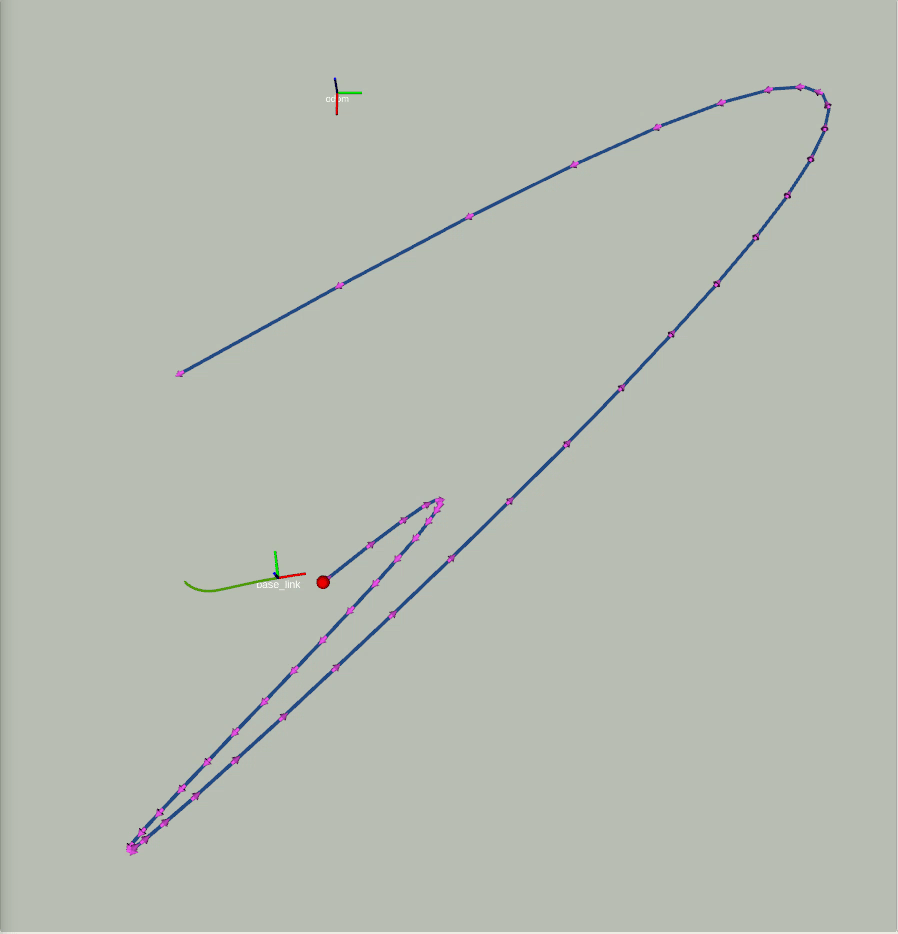
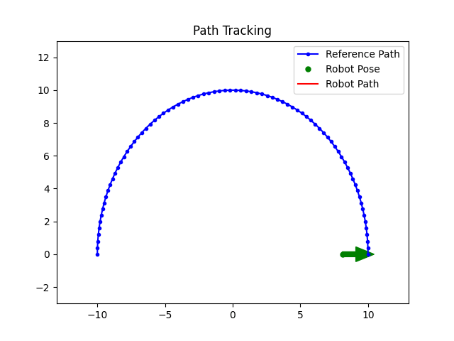
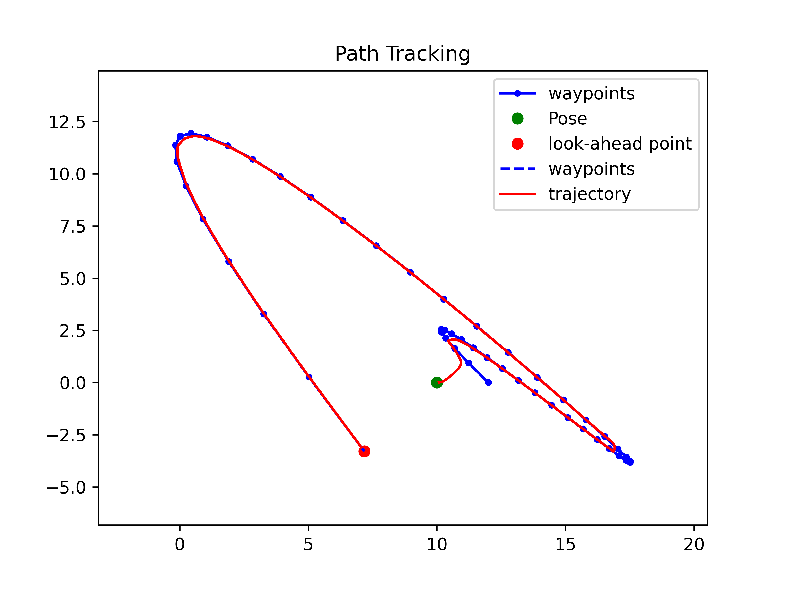
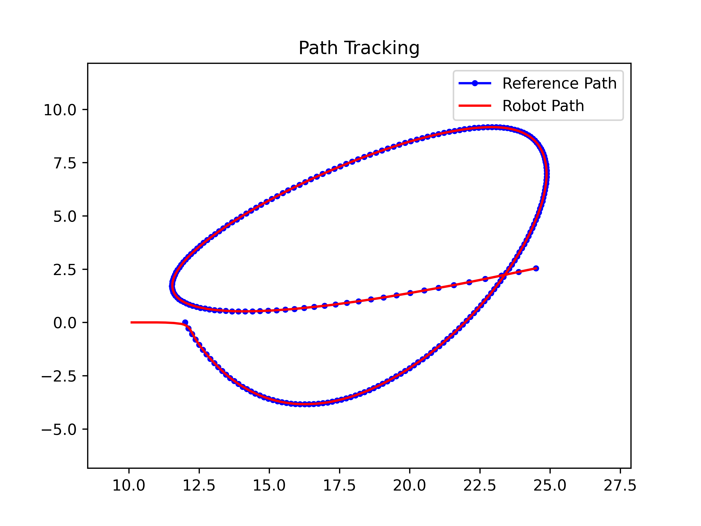

# path_tracking_py

This repository contains a framework for implementing path tracking algorithms and includes implementations of three popular methods: Pure Pursuit, Model Predictive Control (MPC), and Linear Quadratic Regulator (LQR).

This framework is implemented in ROS (real-world applications or GAZEBO simulatin).
However, basic 2D simulation in python is also possible.

## Three path teacking methods

1. Pure Pursuit
2. Model Predictive Control: MPC
3. Linear Quadratic Regulator:LQR

## Reference Trajectory

For now the referecnce plans are saved and parsed as JSON file. The action implementation will be added.

## Simulation/Test Environments

This project provides two simulation/test cases:

### ROS and Gazebo Simulation

Integration with the Robot Operating System (ROS) for more realistic simulations using Gazebo. This is designed for real-world applications

Running 3D simulation in ROS:

```
roslaunch path_tracking_py run_simulation.launch
roslaunch path_tracking_py tracking.launch
```

### 2D Python Simulation

A basic 2D simulation using Python where the robot is considered as a point. This is suitable for quick algorithm prototyping and testing.

Running 2D simulation:

```
python3 scripts/tracking.py
```

## Simulations

<table style="padding:10px">
  <tr>
    <td></td>
  </tr>
</table>

<table style="padding:10px">
  <tr>
    <td></td>
  </tr>
    <tr>
    <td></td>
    <td></td>
  </tr>
</table>

## c

Contributions to this project are welcome.
